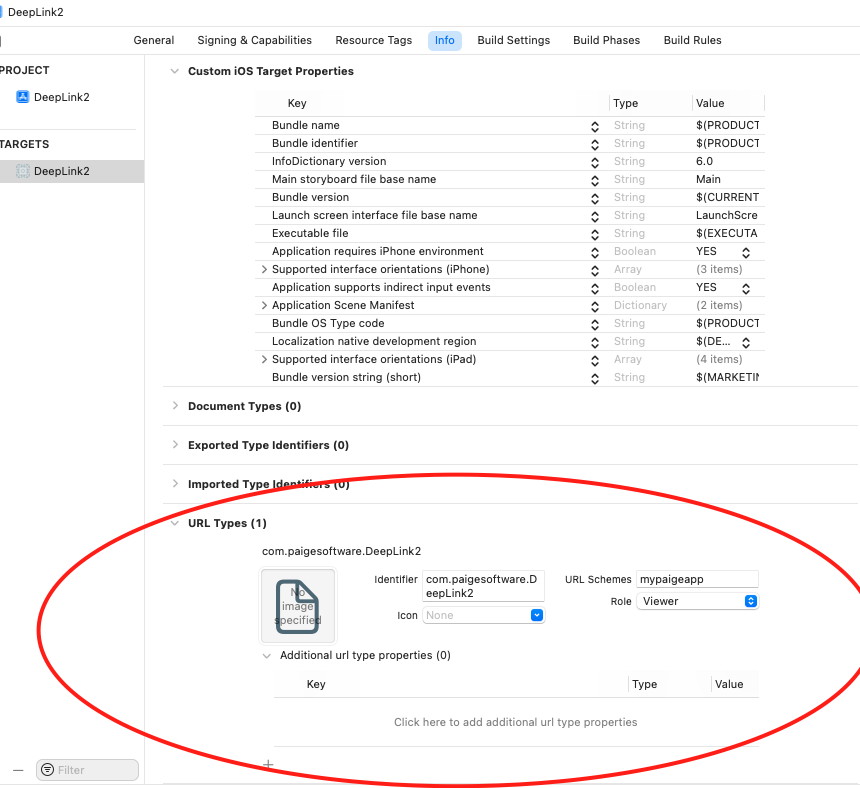

# Create URL Schemes



# AppDelegate

- When app is dead or you don’t use SceneDelegate

```swift
// When application is dead or your app is not using UIWindow
    func application(_ app: UIApplication, open url: URL, options: [UIApplication.OpenURLOptionsKey : Any] = [:]) -> Bool {
        // deeplink2://customerdetail?id=
        print("handling url scheme on application")
        let urlComponents = URLComponents(url: url, resolvingAgainstBaseURL: true)
        let host = urlComponents?.host ?? ""
        print(host)
        if host == "customerdetail" {
            let storyboard = UIStoryboard(name: "Main", bundle: nil)
            let viewController = storyboard.instantiateViewController(withIdentifier: "CustomMessageVC") as? CustomMessageVC
//            viewController?.customerId = urlComponents?.queryItems?.first?.value // ?id=""
            let items = urlComponents?.queryItems ?? []
            for item in items {
                if item.name == "id" {
                    viewController?.customerId = item.value
                }
            }
            window?.rootViewController = viewController
        }
        return true
    }
```

# SceneDelegate

```swift
func scene(_ scene: UIScene, openURLContexts URLContexts: Set<UIOpenURLContext>) {
        // deeplink2://customerdetail?id=
        print("handling url scheme on uiwindow")
        guard let url = URLContexts.first?.url else { return }
        let urlComponents = URLComponents(url: url, resolvingAgainstBaseURL: true)
        let host = urlComponents?.host ?? ""
        print(host)
        if host == "customerdetail" {
            let storyboard = UIStoryboard(name: "Main", bundle: nil)
            let viewController = storyboard.instantiateViewController(withIdentifier: "CustomMessageVC") as? CustomMessageVC
//            viewController?.customerId = urlComponents?.queryItems?.first?.value // ?id=""
            let items = urlComponents?.queryItems ?? []
            for item in items {
                if item.name == "id" {
                    viewController?.customerId = item.value
                }
            }
            window?.rootViewController = viewController
        }
    }
```

# Open URLScheme in App

```swift
@IBAction private func buttonPressed(_ sender: UIButton) {
        let message = "Hitutorial"
        let path = "mypaigeapp://customerdetail?id=\(message)"
        let appUrl = URL(string: path)!
        let webUrl = URL(string: "https://bluemangoglobal.com")!
        if UIApplication.shared.canOpenURL(appUrl) {
            UIApplication.shared.open(appUrl, options: [:], completionHandler: nil)
        } else {
            UIApplication.shared.open(webUrl, options: [:], completionHandler: nil)
        }
    }
```
